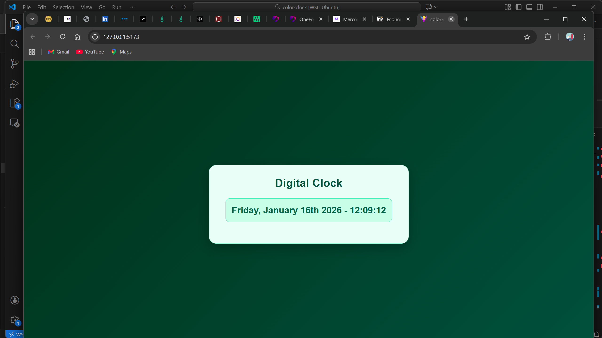

# Color Clock (React + date-fns)

A simple and visually appealing dynamic digital clock built with React, Vite, and date-fns. The clock displays the current date and time in real time with a dark green productivity-themed UI.

---

## Screenshot


## Features

- Displays current date and time dynamically  
- Uses date-fns for date formatting  
- Updates every second  
- Styled with a dark green productivity theme  

---

## Tech Stack

- React + Vite  
- JavaScript (ES6+)  
- date-fns  
- CSS (Custom styling)

---

## Installation & Running Locally

### 1. Clone the repository
```bash
git clone https://github.com/Kukastedev1/color-clock.git
